Kafka


## 一、kafka 群起脚本  

--kk.sh

```shell
#！/bin/bash

case $1 in
"start"){
	
	for i in hadoop102 hadoop103 hadoop104
	do
		echo "========== $i =========="
		ssh $i '/opt/module/kafka/bin/kafka-server-start.sh -daemon /opt/module/kafka/config/server.properties'
	done
};;

"stop"){
	
	for i in hadoop102 hadoop103 hadoop104
	do
		echo "========== $i =========="
		ssh $i '/opt/module/kafka/bin/kafka-server-stop.sh /opt/module/kafka/config/server.properties'
	done
};;

esac
```

给予权限

放置在`/usr/local/bin`目录下

```
chmod 777 文件名
```

使用

```
kk.sh start
```


---

ZooKeeper 群起脚本  

```shell
#！/bin/bash

case $1 in
"start"){
	
	for i in hadoop102 hadoop103 hadoop104
	do
		echo "========== $i =========="
		ssh $i '/opt/module/zookeeper-3.4.10/bin/zkServer.sh start'
	done
};;

"stop"){
	
	for i in hadoop102 hadoop103 hadoop104
	do
		echo "========== $i =========="
		ssh $i '/opt/module/zookeeper-3.4.10/bin/zkServer.sh stop'
	done
};;

"status"){
	
	for i in hadoop102 hadoop103 hadoop104
	do
		echo "========== $i =========="
		ssh $i '/opt/module/zookeeper-3.4.10/bin/zkServer.sh status'
	done
};;

esac
```

----

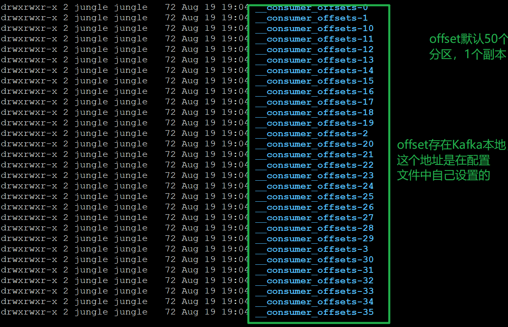

## 二、数据日志分离

### 准备工作

#### 1.一开始就分离

1. 解压安装包  

```
tar -zxvf kafka_2.11-0.11.0.0.tgz -C ~/app/
```

2. 修改解压后的文件名称  

```
mv kafka_2.11-0.11.0.0/ kafka
```


---

#### 2.一开始没分离

1.删除Kafka本地log目录下的所有文件

```
# 这个目录是在配置文件中自己设置的
rm -fr /home/jungle/app/tmp/kafka-logs
```

2.删除zookeeper中Kafka有关的东西

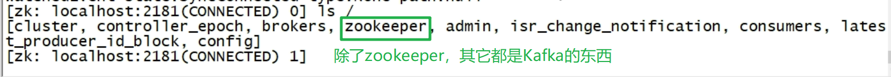


----

### 数据日志分离

修改配置文件  

```
cd config/
vi server.properties
```

```properties
#broker 的全局唯一编号，不能重复
broker.id=0
#删除 topic 功能使能
delete.topic.enable=true
#处理网络请求的线程数量
num.network.threads=3
#用来处理磁盘 IO 的现成数量
num.io.threads=8
#发送套接字的缓冲区大小
socket.send.buffer.bytes=102400
#接收套接字的缓冲区大小
socket.receive.buffer.bytes=102400
#请求套接字的缓冲区大小
socket.request.max.bytes=104857600
#kafka 运行日志存放的路径
log.dirs=/home/jungle/app/kafka/data
#topic 在当前 broker 上的分区个数
num.partitions=1
#用来恢复和清理 data 下数据的线程数量
num.recovery.threads.per.data.dir=1
#segment 文件保留的最长时间，超时将被删除
log.retention.hours=168
#配置连接 Zookeeper 集群地址
zookeeper.connect=192.168.1.18:2181
```

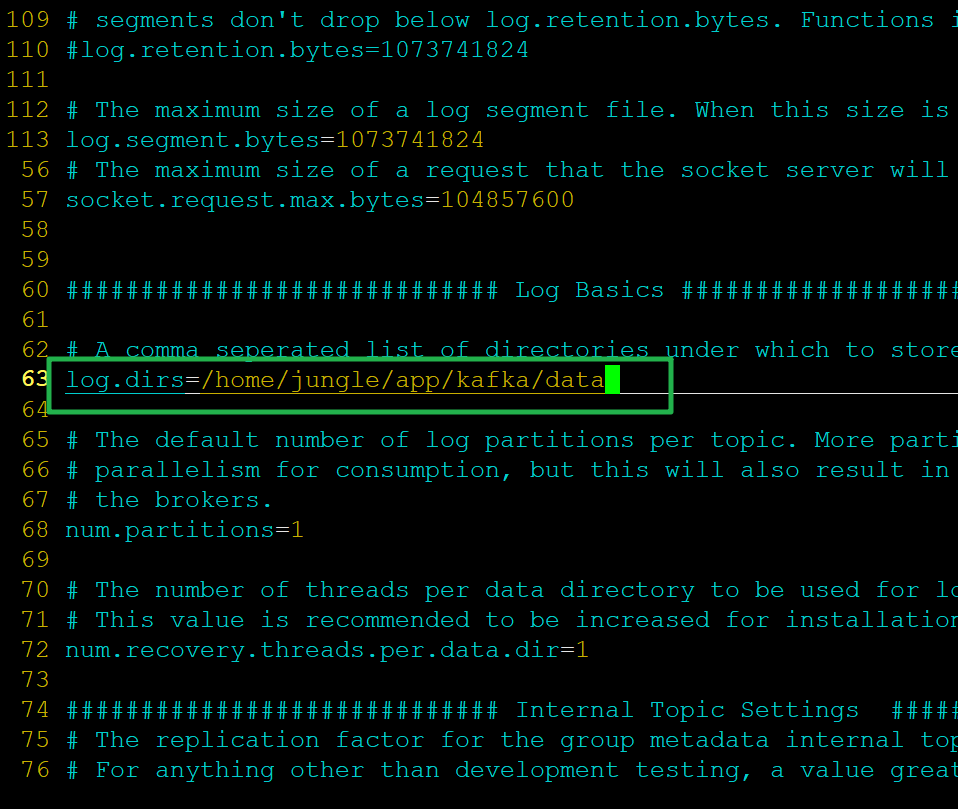

启动

```
bin/kafka-server-start.sh -daemon config/server.properties
```

--启动前

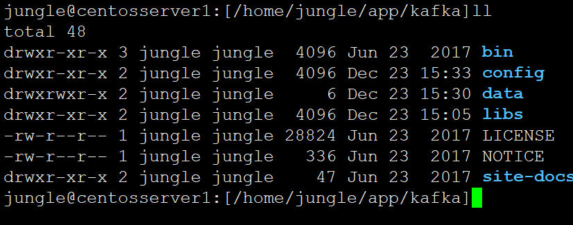

--启动后

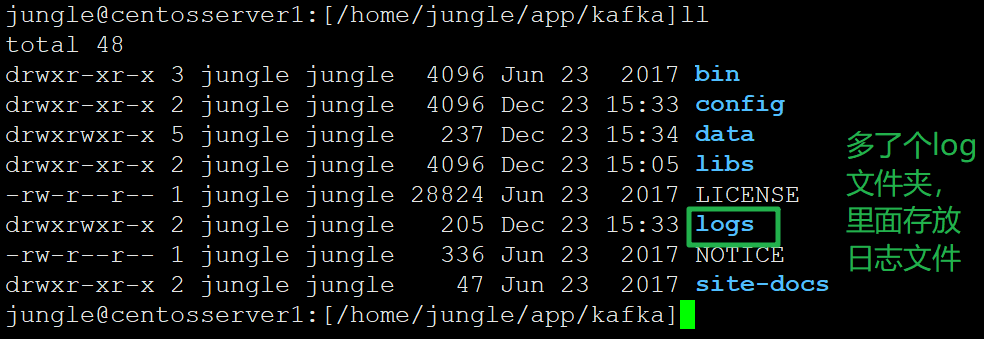

---

```
# 查看日志文件
ll logs/
```

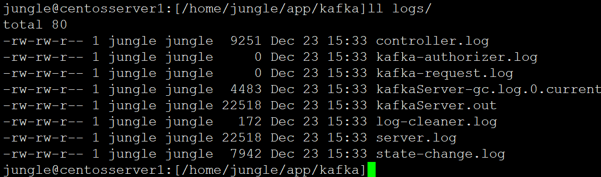

```
# 查看数据文件
ll data/
```

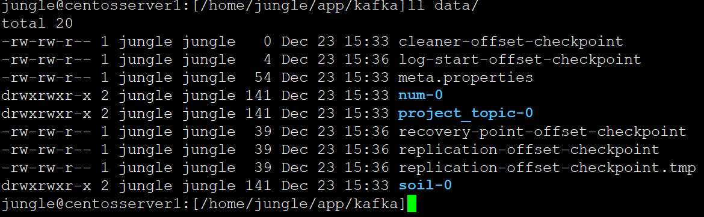

---

## 三、offset

### 1.保存在zookeeper上

```
bin/kafka-topics.sh --create --topic bigdata --zookeeper 192.168.1.18:2181 --partitions 2 --replication-factor 1
```

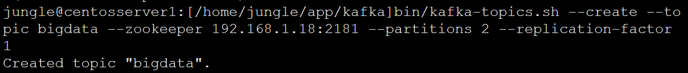

```
bin/kafka-console-producer.sh --broker-list 192.168.1.18:9092 --topic bigdata
```

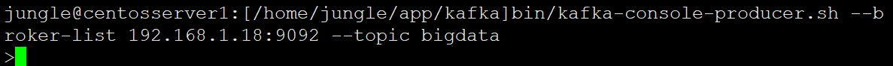

```
bin/kafka-console-consumer.sh --zookeeper 192.168.1.18:2181 --topic bigdata
```

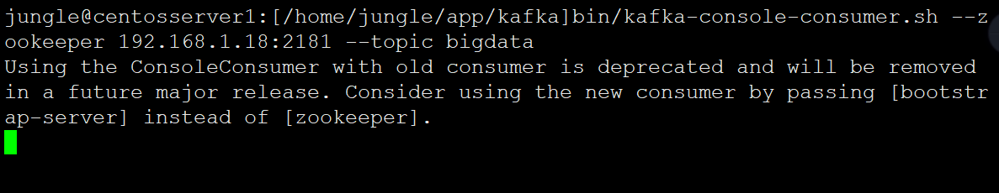

```
# 在生产端输入
>hello
```

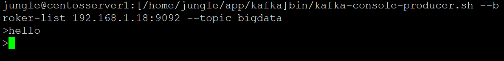

----

消费端

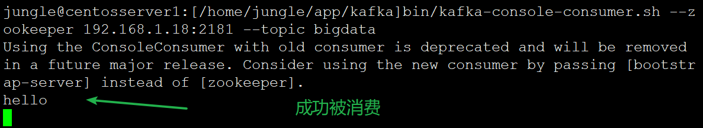

进入zookeeper进行查看

```
zkCli.sh
```


```
get /consumers/console-consumer-10062/offsets/bigdata/0
```

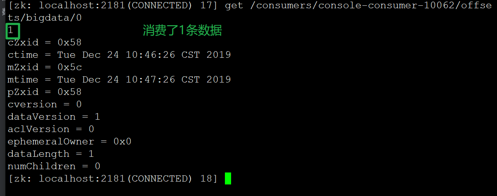

---

生产者生产的消息默认是轮询发送至broker

接连消费几条数据

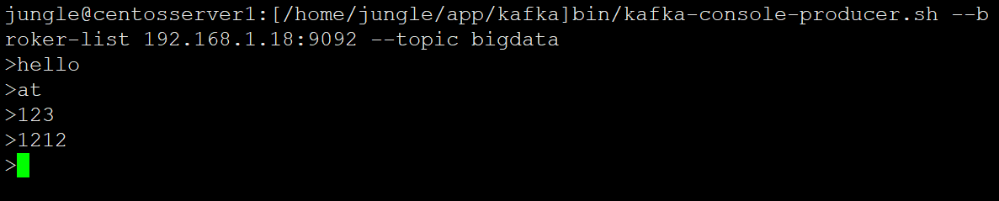

```
get /consumers/console-consumer-10062/offsets/bigdata/0
```

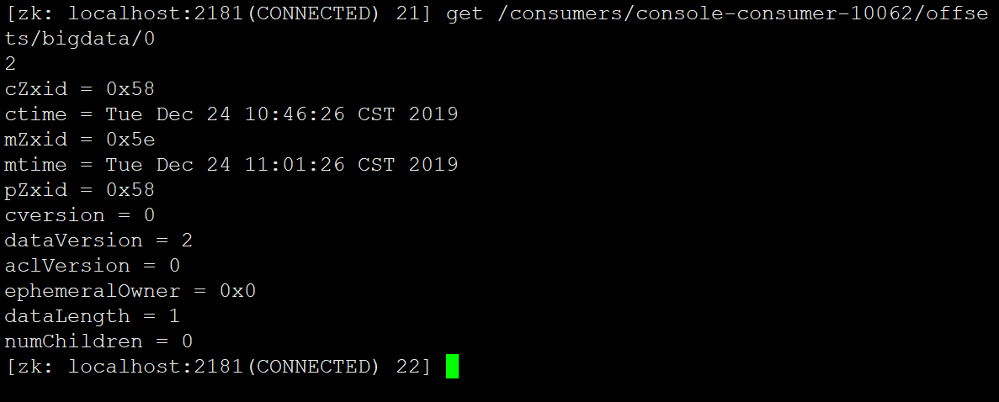

```
get /consumers/console-consumer-10062/offsets/bigdata/1
```

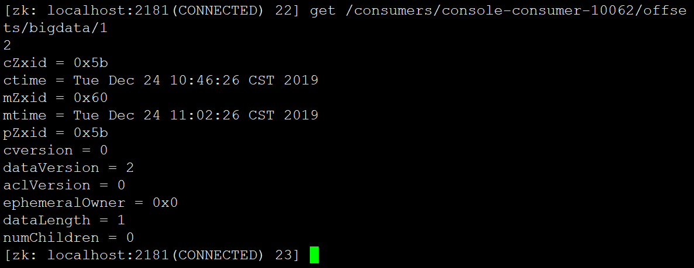

---

### 2.读取Kafka本地offset

```
vi consumer.properties
```


```
exclude.internal.topics=false
```

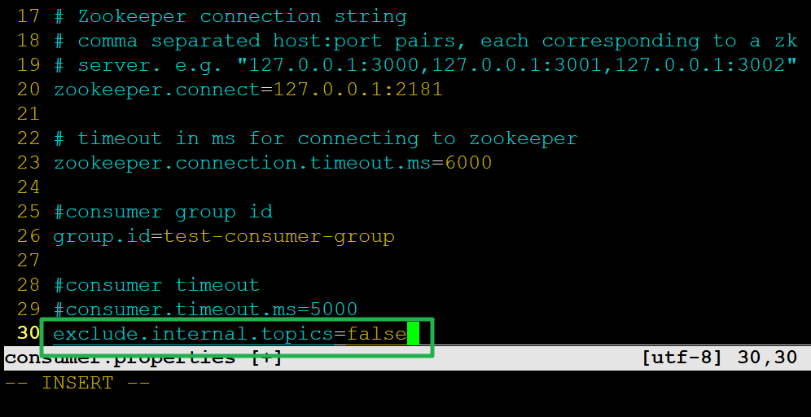


---

```
bin/kafka-console-consumer.sh --bootstrap-server 192.168.1.18:9092 --topic bigdata
```

```
bin/kafka-console-consumer.sh --topic __consumer_offsets --zookeeper 192.168.1.18:2181 --formatter "kafka.coordinator.group.GroupMetadataManager\$OffsetsMessageFormatter" --consumer.config config/consumer.properties --from-beginning
```

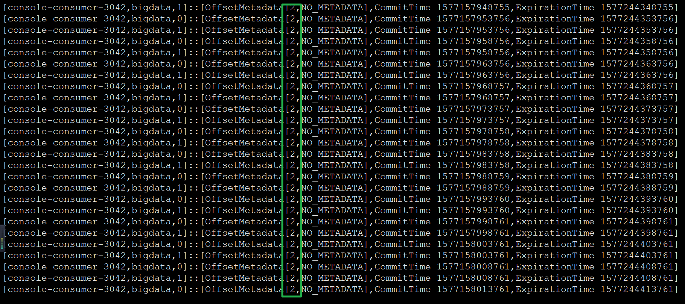

---

## 四、Kafka API  

### 1.创建项目

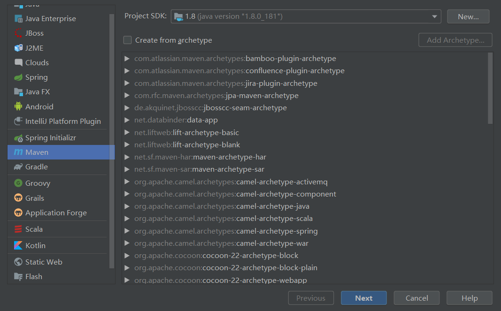

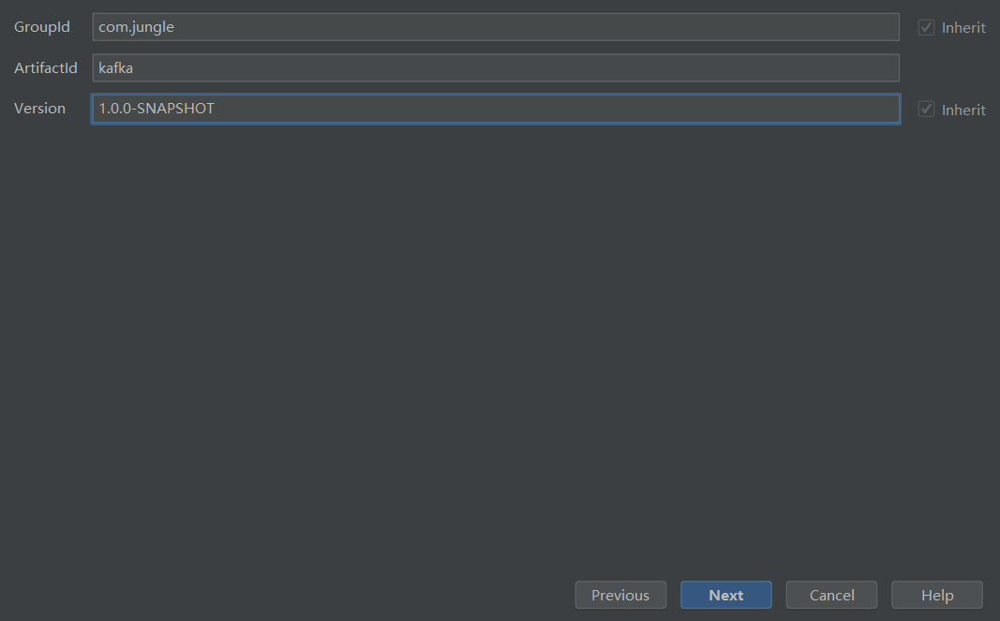

---

导入依赖  

```xml
<dependency>
<groupId>org.apache.kafka</groupId>
<artifactId>kafka-clients</artifactId>
<version>0.11.0.0</version>
</dependency>
```

---

### 2.创建普通生产者

--MyProducer.java

```java
package com.jungle.kafka.producer;

import org.apache.kafka.clients.producer.KafkaProducer;
import org.apache.kafka.clients.producer.ProducerConfig;
import org.apache.kafka.clients.producer.ProducerRecord;

import java.util.Properties;

public class MyProducer {

    public static void main(String[] args) {

        //1.创建Kafka生产者的配置信息
        Properties properties = new Properties();

        //2.kafka 集群， broker-list
//        properties.put(ProducerConfig.BOOTSTRAP_SERVERS_CONFIG, "192.168.1.18:9092");
        properties.put("bootstrap.servers", "192.168.1.18:9092");

        //3.ACK应答级别
        properties.put("acks", "all");

        //4.重试次数
        properties.put("retries", 3);

        //5.批次大小
        //一次发送的大小
        //达到16k后发送
        properties.put("batch.size", 16384);

        //6.等待时间
        //1ms后发送
        properties.put("linger.ms", 1);

        //7.RecordAccumulator 缓冲区大小
        properties.put("buffer.memory", 33554432);


        //8.Key,Value的序列化类
        properties.put("key.serializer",
                "org.apache.kafka.common.serialization.StringSerializer");

        properties.put("value.serializer",
                "org.apache.kafka.common.serialization.StringSerializer");

        //9.创建生产者对象
        KafkaProducer<String, String> producer = new KafkaProducer<>(properties);

        //10.发送数据
        for (int i = 0; i < 10; i++) {

            producer.send(new ProducerRecord<>("first","jungle--" + i));

        }


        //11.关闭资源
        producer.close();
    }
}

```


---

创建主题

```
bin/kafka-topics.sh --zookeeper 192.168.1.18:2181 --create --replication-factor 1 --partitions 1 --topic first
```

创建消费端

```
bin/kafka-console-consumer.sh --zookeeper 192.168.1.18:2181 --topic first
```

---

运行MyProducer

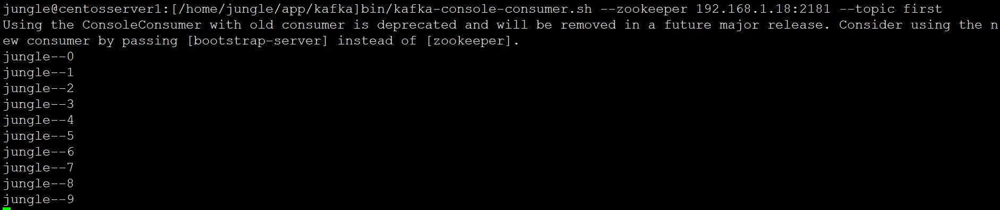

---

### 3.创建带回调函数的生产者

--CallBackProducer.java

```java
package com.jungle.kafka.producer;

import org.apache.kafka.clients.producer.*;

import java.util.Properties;

public class CallBackProducer {

    public static void main(String[] args) {

        //1.创建配置信息
        Properties properties = new Properties();
        properties.put(ProducerConfig.BOOTSTRAP_SERVERS_CONFIG,"192.168.1.18:9092");
        properties.put(ProducerConfig.KEY_SERIALIZER_CLASS_CONFIG,"org.apache.kafka.common.serialization.StringSerializer");
        properties.put(ProducerConfig.VALUE_SERIALIZER_CLASS_CONFIG,"org.apache.kafka.common.serialization.StringSerializer");


        //2.创建生产者对象
        KafkaProducer<String,String> producer = new KafkaProducer<>(properties);

        //3.发送数据
        for (int i = 0; i < 10; i++) {

            //producer.send(new ProducerRecord<>("first", "jungle--" + i), new Callback() {
            producer.send(new ProducerRecord<>("first", "jungle--" + i), (recordMetadata, e) -> {
                if (e == null) {
                    System.out.println((recordMetadata.partition() + "--" + recordMetadata.offset()));
                } else {
                    e.printStackTrace();
                }
            });
        }

        //4.关闭资源
        producer.close();
    }

}

```

创建消费端

```
bin/kafka-console-consumer.sh --zookeeper 192.168.1.18:2181 --topic first
```

启动CallBackProducer

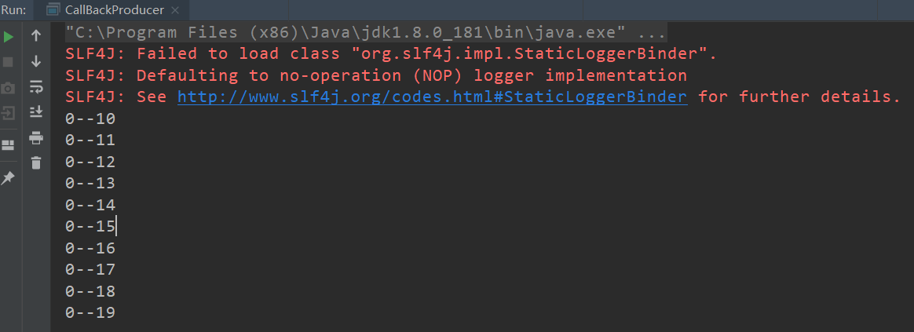

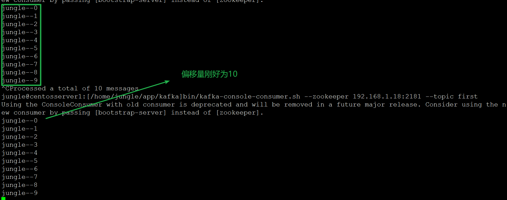

---

### 4.生产者分区策略测试

--StrategyProducer.java

```java
package com.jungle.kafka.producer;

import org.apache.kafka.clients.producer.KafkaProducer;
import org.apache.kafka.clients.producer.ProducerConfig;
import org.apache.kafka.clients.producer.ProducerRecord;

import java.util.Properties;

public class StrategyProducer {
    public static void main(String[] args) {

        //1.创建配置信息
        Properties properties = new Properties();
        properties.put(ProducerConfig.BOOTSTRAP_SERVERS_CONFIG,"192.168.1.18:9092");
        properties.put(ProducerConfig.KEY_SERIALIZER_CLASS_CONFIG,"org.apache.kafka.common.serialization.StringSerializer");
        properties.put(ProducerConfig.VALUE_SERIALIZER_CLASS_CONFIG,"org.apache.kafka.common.serialization.StringSerializer");


        //2.创建生产者对象
        KafkaProducer<String,String> producer = new KafkaProducer<>(properties);

        //3.发送数据
        for (int i = 0; i < 10; i++) {

            //producer.send(new ProducerRecord<>("first", "jungle--" + i), new Callback() {
            //producer.send(new ProducerRecord<>("first", 0, "jungle","jungle--" + i), (recordMetadata, e) -> {
            producer.send(new ProducerRecord<>("first", "jungle","jungle--" + i), (recordMetadata, e) -> {
                if (e == null) {
                    System.out.println((recordMetadata.partition() + "--" + recordMetadata.offset()));
                } else {
                    e.printStackTrace();
                }
            });
        }

        //4.关闭资源
        producer.close();
    }
}

```

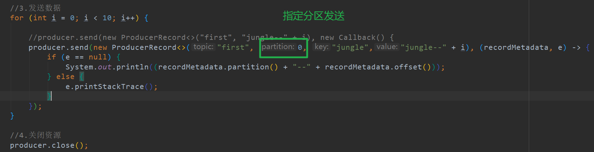

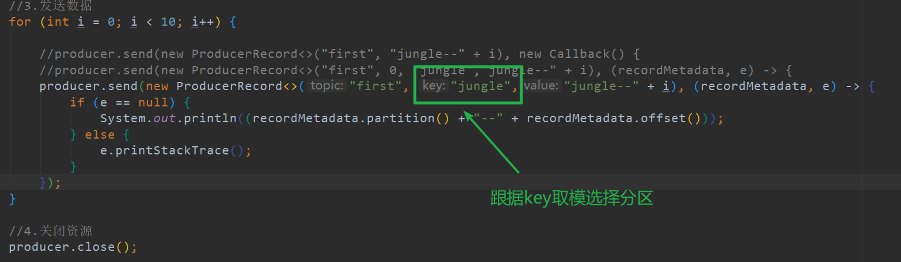

---

## 五、自定义分区的生成者

### 1.自定义partition分区器

--MyPartitioner

```java
package com.jungle.kafka.partitioner;

import org.apache.kafka.clients.producer.Partitioner;
import org.apache.kafka.common.Cluster;

import java.util.Map;

public class MyPartitioner implements Partitioner {

    /**
     *
     * @param s topic
     * @param o key
     * @param bytes
     * @param o1 value
     * @param bytes1
     * @param cluster Kafka集群
     * @return
     */
    @Override
    public int partition(String s, Object o, byte[] bytes, Object o1, byte[] bytes1, Cluster cluster) {

        //这里写实际业务中的业务逻辑

//        //获取topic的partition数量
//        Integer integer = cluster.partitionCountForTopic(s);
//
//        return o.toString().hashCode() % integer;
        return 0;
    }

    @Override
    public void close() {

    }

    @Override
    public void configure(Map<String, ?> map) {

    }
}

```

---


### 2.使用自定义的分区器

---PartitionProducer

```java
package com.jungle.kafka.producer;

import org.apache.kafka.clients.producer.KafkaProducer;
import org.apache.kafka.clients.producer.ProducerRecord;

import java.util.Properties;

public class PartitionProducer {

    public static void main(String[] args) {

        //1.创建Kafka生产者的配置信息
        Properties properties = new Properties();

        //2.kafka 集群， broker-list
//        properties.put(ProducerConfig.BOOTSTRAP_SERVERS_CONFIG, "192.168.1.18:9092");
        properties.put("bootstrap.servers", "192.168.1.18:9092");

        //3.ACK应答级别
        properties.put("acks", "all");

        //4.重试次数
        properties.put("retries", 3);

        //5.批次大小
        //一次发送的大小
        //达到16k后发送
        properties.put("batch.size", 16384);

        //6.等待时间
        //1ms后发送
        properties.put("linger.ms", 1);

        //7.RecordAccumulator 缓冲区大小
        properties.put("buffer.memory", 33554432);


        //8.Key,Value的序列化类
        properties.put("key.serializer",
                "org.apache.kafka.common.serialization.StringSerializer");

        properties.put("value.serializer",
                "org.apache.kafka.common.serialization.StringSerializer");

        properties.put("partitioner.class","com.jungle.kafka.partitioner.MyPartitioner");

        //9.创建生产者对象
        KafkaProducer<String, String> producer = new KafkaProducer<>(properties);

        //10.发送数据
        for (int i = 0; i < 10; i++) {

            producer.send(new ProducerRecord<>("first","jungle--" + i));

        }


        //11.关闭资源
        producer.close();
    }
}

```

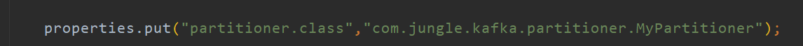

---

## 六、同步发送生成者

作用：保证一个分区内被生产的消息是有序的

--SynProducer

```java
package com.jungle.kafka.producer;

import org.apache.kafka.clients.producer.KafkaProducer;
import org.apache.kafka.clients.producer.ProducerRecord;
import org.apache.kafka.clients.producer.RecordMetadata;

import java.util.Properties;
import java.util.concurrent.ExecutionException;
import java.util.concurrent.Future;

public class SynProducer {

    public static void main(String[] args) throws ExecutionException, InterruptedException {

        //1.创建Kafka生产者的配置信息
        Properties properties = new Properties();

        //2.kafka 集群， broker-list
//        properties.put(ProducerConfig.BOOTSTRAP_SERVERS_CONFIG, "192.168.1.18:9092");
        properties.put("bootstrap.servers", "192.168.1.18:9092");

        //3.ACK应答级别
        properties.put("acks", "all");

        //4.重试次数
        properties.put("retries", 3);

        //5.批次大小
        //一次发送的大小
        //达到16k后发送
        properties.put("batch.size", 16384);

        //6.等待时间
        //1ms后发送
        properties.put("linger.ms", 1);

        //7.RecordAccumulator 缓冲区大小
        properties.put("buffer.memory", 33554432);


        //8.Key,Value的序列化类
        properties.put("key.serializer",
                "org.apache.kafka.common.serialization.StringSerializer");

        properties.put("value.serializer",
                "org.apache.kafka.common.serialization.StringSerializer");

        //9.创建生产者对象
        KafkaProducer<String, String> producer = new KafkaProducer<>(properties);

        //10.发送数据
        for (int i = 0; i < 10; i++) {
            
            Future<RecordMetadata> first = producer.send(new ProducerRecord<>("first", "jungle--" + i));

            RecordMetadata recordMetadata = first.get();

        }


        //11.关闭资源
        producer.close();
    }
}

```

---

## 七、简单消费者

--MyConsumer

```java
package com.jungle.kafka.consumer;

import org.apache.kafka.clients.consumer.ConsumerConfig;
import org.apache.kafka.clients.consumer.ConsumerRecord;
import org.apache.kafka.clients.consumer.ConsumerRecords;
import org.apache.kafka.clients.consumer.KafkaConsumer;

import java.util.Arrays;
import java.util.Collections;
import java.util.Properties;

public class MyConsumer {

    public static void main(String[] args) {

        //1.创建消费者配置信息
        Properties properties = new Properties();

        //2.给配置信息赋值


        //连接的集群
        properties.put(ConsumerConfig.BOOTSTRAP_SERVERS_CONFIG,"192.168.1.18:9092");

        //开启自动提交
        properties.put(ConsumerConfig.ENABLE_AUTO_COMMIT_CONFIG,true);

        //自动提交的延时
        properties.put(ConsumerConfig.AUTO_COMMIT_INTERVAL_MS_CONFIG,"1000");

        //Key,Value的反序列化
        properties.put(ConsumerConfig.KEY_DESERIALIZER_CLASS_CONFIG,"org.apache.kafka.common.serialization.StringDeserializer");
        properties.put(ConsumerConfig.VALUE_DESERIALIZER_CLASS_CONFIG,"org.apache.kafka.common.serialization.StringDeserializer");

        //消费者组
        properties.put(ConsumerConfig.GROUP_ID_CONFIG,"bigdata");

        //创建消费者
        KafkaConsumer<String,String> consumer = new KafkaConsumer<>(properties);

        //订阅主题
        //可以订阅多个主题
//        consumer.subscribe(Arrays.asList("first","second"));
        consumer.subscribe(Collections.singletonList("first"));

        while (true) {
            //获取数据
            ConsumerRecords<String, String> consumerRecords = consumer.poll(100);

            //解析并打印consumerRecords
            for (ConsumerRecord<String, String> consumerRecord : consumerRecords) {

                System.out.println(consumerRecord.key() + "--" + consumerRecord.value());
            }
        }

    }
}

```

---

## 八、消费者重置offset

--MyConsumer

```java
package com.jungle.kafka.consumer;

import org.apache.kafka.clients.consumer.ConsumerConfig;
import org.apache.kafka.clients.consumer.ConsumerRecord;
import org.apache.kafka.clients.consumer.ConsumerRecords;
import org.apache.kafka.clients.consumer.KafkaConsumer;

import java.util.Arrays;
import java.util.Collections;
import java.util.Properties;

public class MyConsumer {

    public static void main(String[] args) {

        //1.创建消费者配置信息
        Properties properties = new Properties();

        //2.给配置信息赋值


        //连接的集群
        properties.put(ConsumerConfig.BOOTSTRAP_SERVERS_CONFIG,"192.168.1.18:9092");

        //开启自动提交
        properties.put(ConsumerConfig.ENABLE_AUTO_COMMIT_CONFIG,true);

        //自动提交的延时
        properties.put(ConsumerConfig.AUTO_COMMIT_INTERVAL_MS_CONFIG,"1000");

        //Key,Value的反序列化
        properties.put(ConsumerConfig.KEY_DESERIALIZER_CLASS_CONFIG,"org.apache.kafka.common.serialization.StringDeserializer");
        properties.put(ConsumerConfig.VALUE_DESERIALIZER_CLASS_CONFIG,"org.apache.kafka.common.serialization.StringDeserializer");

        //消费者组
        properties.put(ConsumerConfig.GROUP_ID_CONFIG,"bigdata1");

        //重置消费者的offset
        properties.put(ConsumerConfig.AUTO_OFFSET_RESET_CONFIG,"earliest");

        //创建消费者
        KafkaConsumer<String,String> consumer = new KafkaConsumer<>(properties);

        //订阅主题
        //可以订阅多个主题
//        consumer.subscribe(Arrays.asList("first","second"));
        consumer.subscribe(Collections.singletonList("first"));

        while (true) {
            //获取数据
            ConsumerRecords<String, String> consumerRecords = consumer.poll(100);

            //解析并打印consumerRecords
            for (ConsumerRecord<String, String> consumerRecord : consumerRecords) {

                System.out.println(consumerRecord.key() + "--" + consumerRecord.value());
            }
        }

    }
}

```


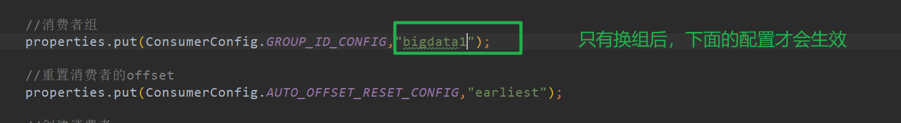

---

## 九、拦截器案例  

### 1.需求：  

实现一个简单的双 interceptor 组成的拦截链。第一个 interceptor 会在消息发送前将时间
戳信息加到消息 value 的最前部；第二个 interceptor 会在消息发送后更新成功发送消息数或
失败发送消息数  

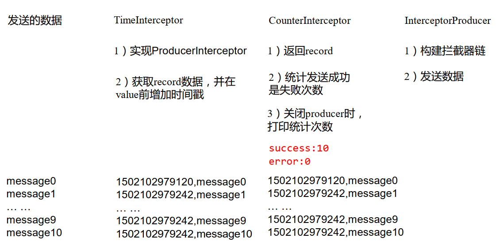

---

### 2.程序

--TimeInterceptor

```java
package com.jungle.kafka.interceptor;

import org.apache.kafka.clients.producer.ProducerInterceptor;
import org.apache.kafka.clients.producer.ProducerRecord;
import org.apache.kafka.clients.producer.RecordMetadata;

import java.util.Map;

public class TimeInterceptor implements ProducerInterceptor<String,String> {

    @Override
    public void configure(Map<String, ?> configs) {

    }
    @Override
    public ProducerRecord<String, String> onSend(ProducerRecord<String, String> record) {
        //1.取出数据
        String value = record.value();

        //2.创建一个新的ProducerRecord对象，并返回
        return new ProducerRecord<>(record.topic(),record.partition(),
                record.key(),System.currentTimeMillis()+","+value);

    }

    @Override
    public void onAcknowledgement(RecordMetadata metadata, Exception exception) {

    }

    @Override
    public void close() {

    }


}

```

---

--CounterInterceptor

```java
package com.jungle.kafka.interceptor;

import org.apache.kafka.clients.producer.ProducerInterceptor;
import org.apache.kafka.clients.producer.ProducerRecord;
import org.apache.kafka.clients.producer.RecordMetadata;

import java.util.Map;

public class CounterInterceptor implements ProducerInterceptor<String,String> {

    int success;
    int error;

    @Override
    public void configure(Map<String, ?> configs) {

    }
    @Override
    public ProducerRecord<String, String> onSend(ProducerRecord<String, String> record) {

        return record;
    }

    @Override
    public void onAcknowledgement(RecordMetadata metadata, Exception exception) {

        if (metadata != null) {
            success++;
        } else {
            error++;
        }
    }

    @Override
    public void close() {

        System.out.println("success" + success);
        System.out.println("error" + error);
    }


}

```

---

--InterceptorProducer

```java
package com.jungle.kafka.producer;

import org.apache.kafka.clients.producer.KafkaProducer;
import org.apache.kafka.clients.producer.ProducerConfig;
import org.apache.kafka.clients.producer.ProducerRecord;

import java.util.ArrayList;
import java.util.Properties;

public class InterceptorProducer {
    public static void main(String[] args) {

        //1.创建Kafka生产者的配置信息
        Properties properties = new Properties();

        //2.kafka 集群， broker-list
//        properties.put(ProducerConfig.BOOTSTRAP_SERVERS_CONFIG, "192.168.1.18:9092");
        properties.put("bootstrap.servers", "192.168.1.18:9092");

        //3.ACK应答级别
        properties.put("acks", "all");

        //4.重试次数
        properties.put("retries", 3);

        //5.批次大小
        //一次发送的大小
        //达到16k后发送
        properties.put("batch.size", 16384);

        //6.等待时间
        //1ms后发送
        properties.put("linger.ms", 1);

        //7.RecordAccumulator 缓冲区大小
        properties.put("buffer.memory", 33554432);


        //8.Key,Value的序列化类
        properties.put("key.serializer",
                "org.apache.kafka.common.serialization.StringSerializer");

        properties.put("value.serializer",
                "org.apache.kafka.common.serialization.StringSerializer");

        //添加拦截器
        ArrayList<String> interceptors = new ArrayList<>();
        interceptors.add("com.jungle.kafka.interceptor.TimeInterceptor");
        interceptors.add("com.jungle.kafka.interceptor.CounterInterceptor");

        properties.put(ProducerConfig.INTERCEPTOR_CLASSES_CONFIG,interceptors);

        //9.创建生产者对象
        KafkaProducer<String, String> producer = new KafkaProducer<>(properties);

        //10.发送数据
        for (int i = 0; i < 10; i++) {

            producer.send(new ProducerRecord<>("first","jungle--" + i));

        }


        //11.关闭资源
        producer.close();
    }
}

```


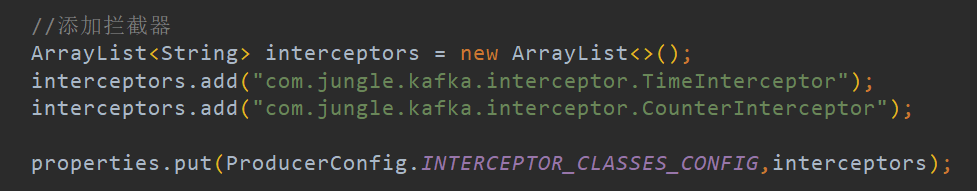

---

### 3.测试

```
bin/kafka-console-consumer.sh --zookeeper 192.168.1.18:2181 --topic first
```

启动InterceptorProducer

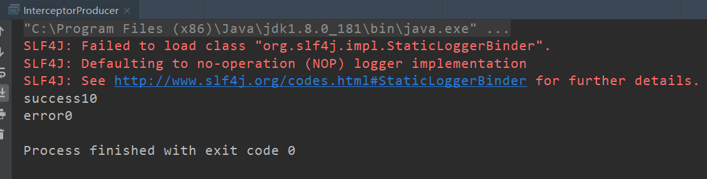

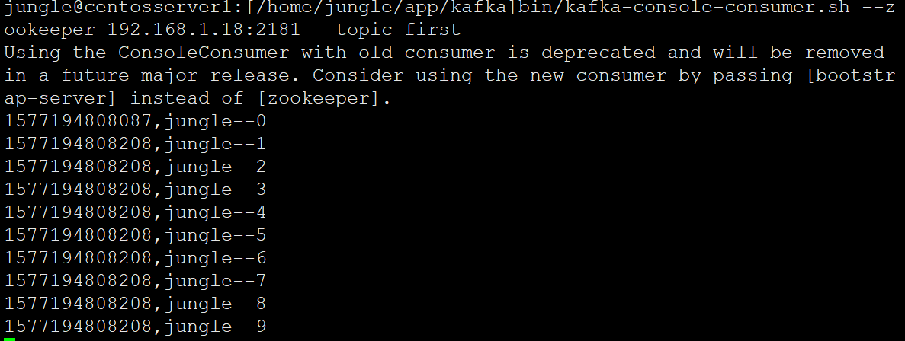

----

## 十、Kafka 监控  

### 1.修改 kafka 启动命令  

修改 kafka-server-start.sh 命令中  

```
export KAFKA_HEAP_OPTS="-server -Xms2G -Xmx2G -XX:PermSize=128m -XX:+UseG1GC -XX:MaxGCPauseMillis=200 -XX:ParallelGCThreads=8 -XX:ConcGCThreads=5 -XX:InitiatingHeapOccupancyPercent=70"
export JMX_PORT="9999"
```

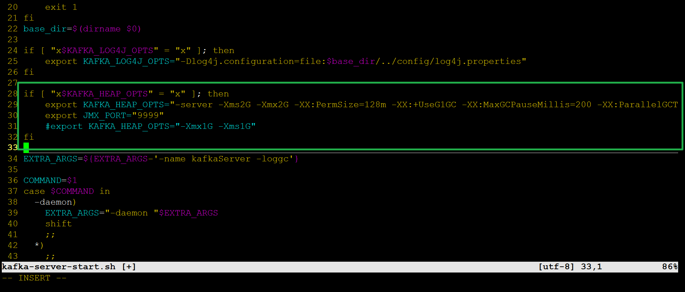

---

### 2.解压

上传压缩包 kafka-eagle-bin-1.3.7.tar.gz   

要解压两次

```
tar -zxvf kafka-eagle-bin-1.3.7.tar.gz
```

```
cd kafka-eagle-bin-1.3.7
```

```
tar -zxvf kafka-eagle-web-1.3.7-bin.tar.gz -C ~/app/
```

### 3.配置环境变量

```
vi ~/.bash_profile
```

```
export KE_HOME=/home/jungle/app/eagle
export PATH=$KE_HOME/bin:$PATH
```

```
source ~/.bash_profile
```

---

### 4.给启动文件执行权限  

```
cd bin
chmod 777 ke.sh
```

---

### 5.修改配置文件  


```
cd conf/
vi system-config.properties
```

```properties
######################################
# multi zookeeper&kafka cluster list
######################################
kafka.eagle.zk.cluster.alias=cluster1
cluster1.zk.list=192.168.1.18:2181
######################################
# kafka offset storage
######################################
cluster1.kafka.eagle.offset.storage=kafka
######################################
# enable kafka metrics
######################################
kafka.eagle.metrics.charts=true
kafka.eagle.sql.fix.error=false
######################################
# kafka jdbc driver address
######################################
kafka.eagle.driver=com.mysql.jdbc.Driver
kafka.eagle.url=jdbc:mysql://192.168.1.18:9906/ke?useUnicode=true&characterEncoding=UTF-8&zeroDateTimeBehavior=convertToNull
kafka.eagle.username=root
kafka.eagle.password=123456
```

---

启动

```
bin/ke.sh start
```

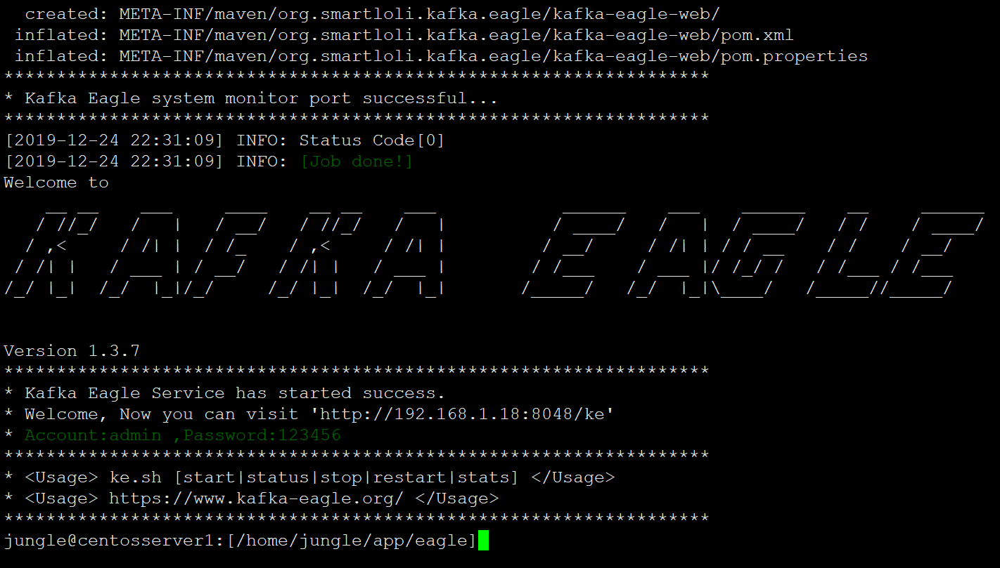

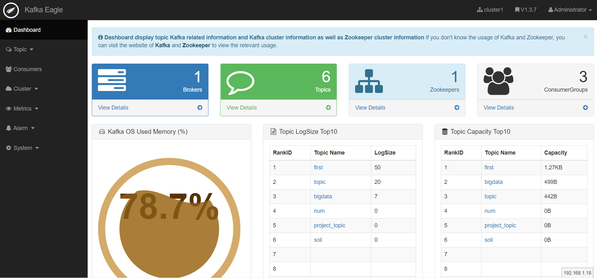

---

